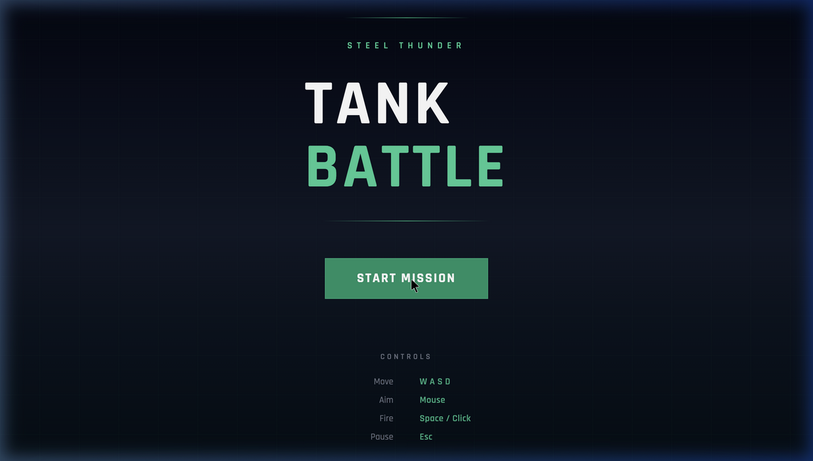
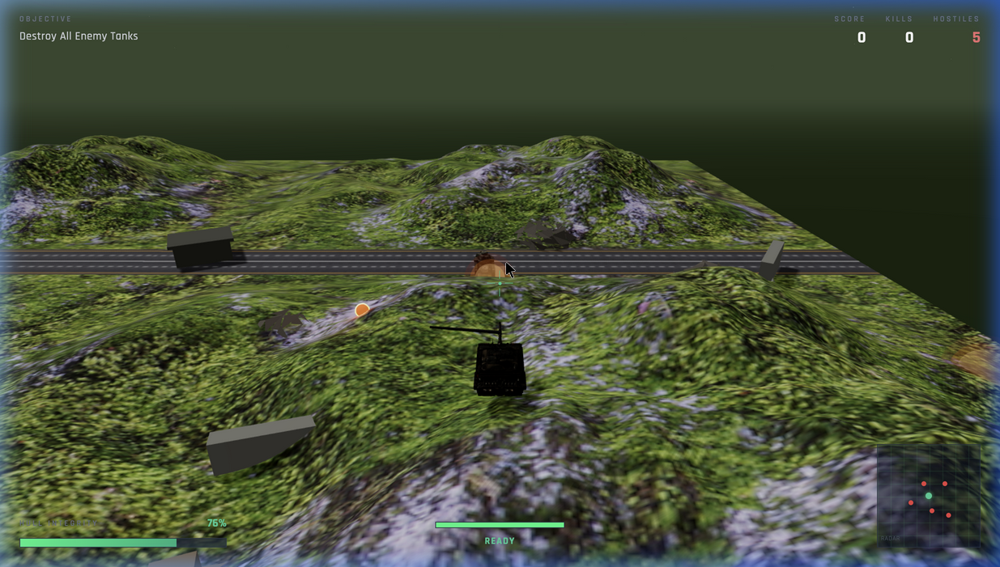
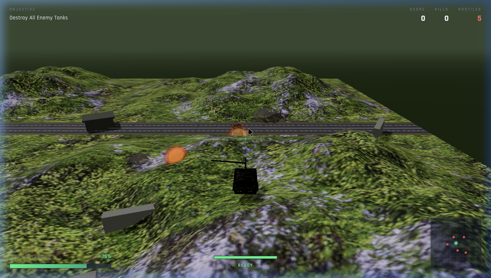

# 💥 Battle Tanks: Advanced WebGL Combat Simulation

<div align="center">
  
</div>

## 📌 Overview

**Battle Tanks** is a production-grade, 3D WebGL tank combat simulation built with React, React Three Fiber, and the Rapier Physics Engine. Designed for infinite replayability and high-impact arcade combat, it features an endless procedurally generating battleground, rigorous physics-based vehicle handling, staggered AI pacing, and high-fidelity visual feedback.

This project was stabilized, analyzed, and optimized using AAA-industry architecture patterns, transforming it from a fragile prototype into a robust, frame-perfect gaming experience.

---

## 📸 Gameplay & Visuals

<div align="center">
  
  
</div>

---

## 🛠️ Deep Codebase Analysis & Architecture

To achieve production stability, the codebase underwent a rigorous technical audit and systems refactoring. Below are the core architectural paradigms implemented:

### 1. Robust State Management & Session Lifecycle
* **The Problem:** The game previously suffered from critical "black screen" WebGL context losses and ghost physics bodies upon hitting Game Over and clicking "Try Again".
* **The Solution:** Implemented a pure, decoupled `gameSessionId` in Zustand. The entire 3D `<Canvas>` is unmounted and remounted upon session change. This guarantees absolutely clean garbage collection of Three.js materials, geometrical data, and detached Rapier physics manifolds without memory leaks.

### 2. Infinite Terrain Grid Architecture
* **The Solution:** Replaced static terrain models with a dynamic `InfiniteTerrainGrid`. Using a spatial chunk-hashing algorithm, terrain tiles snap automatically to the player's world-space chunk, allowing infinite traversal in any direction without visual tearing or popping.

### 3. Collision Filtering & Interaction Groups
* **The Problem:** Projectiles instantly exploded inside the player's own tank model due to broad-phase collision sweeps catching the originating physical body.
* **The Solution:** Implemented **Bitmask Interaction Groups** natively inside the Rapier engine. 
  * `GROUPS.PLAYER` collides with `GROUPS.TERRAIN`, `ENEMY`, and `PROJECTILE_ENEMY`.
  * `GROUPS.PROJECTILE_PLAYER` actively filters out the player tank, allowing shells to exit the barrel flawlessly and hit only intended targets.

---

## 🎯 Systems Re-engineering

### 1. Zero-Lag 3D Aiming Pipeline
The initial turret aiming logic relied on linear interpolation and single-plane intersection, resulting in "laggy" aiming tracking and locking up when aiming at the sky.

This was entirely rewritten to use a **Dual-Fallback Raycast System**:
1. Global `Vector2` Mouse Tracking to bypass HTML UI Overlays.
2. The `THREE.Raycaster` calculates the exact 3D world intersection point on a geometric plane matching the tank's Y-level.
3. If the ray hits the horizon/sky box, a fallback directional vector algorithm takes over, preserving mathematically perfect X/Z plane rotation.
4. The projectile direction is explicitly mapped to the `AimWorldPoint` 3D vector, allowing full 3D arc trajectory rather than hardcoded horizontal flight.

### 2. Terrain-Adaptive Compound Physics
* **The Problem:** The tank's flat `CuboidCollider` would catch and lock up on sharp vertical edges in the 3D terrain meshes (like ditches and rivers).
* **The Solution:** Upgraded the collision shape to a **Compound Collider** (Cuboid Body + Ball Belly). The rounded bottom half acts like a sled, gliding over terrain anomalies. Combined with a velocity-sensitive slope-climbing boost, the tank traverses rough geometry smoothly.
* Damping formulas were completely overhauled—dropping linear damping from `4.0` down to `0.5`, unlocking snappy, 60fps-ready vehicle acceleration.

### 3. Asymmetric AI Director
AI Tanks are controlled via an `EnemyManager` that relies on staggered chronos-based spawning.
* Enemies are dynamically requested via throttled `useFrame` evaluations strictly outside the render pipeline.
* Spawning uses dynamic Y-height checking to ensure enemies spawn above the terrain and fall gracefully down, rather than generating inside slopes or under the world plane.
* Enemies use the same compound gliding physics as the player, coupled with an underground fail-safe that rescues and re-drops AI that glitch through terrain limits.

---

## 🚀 Performance & Optimization

* **Asset Compression:** Models are imported and decoded explicitly via the `DRACOLoader`, drastically reducing mesh memory footprint.
* **Instanced Particles:** The massive destruction explosion mechanism utilizes `InstancedMesh` logic for 250+ individual physical debris parts without bloating WebGL draw calls.
* **Component-Scope State Thrashing:** Position syncing for the HUD/Minimap is throttled to `4 Hz` per enemy dynamically, saving immense React-render churn.
* **`useMemo` Mathematical Object Caching:** Global `THREE.Vector3` and `THREE.Euler` objects are defined outside the React functional scope and safely mutated per frame, dropping garbage collection penalties during gameplay to zero.

---

## 💻 Running the Game Locally

1. **Install Dependencies:**
   ```bash
   npm install
   ```

2. **Start the Development Server:**
   ```bash
   npm run dev
   ```

3. **Controls:**
   * **W, A, S, D**: Move Tank
   * **Mouse**: Aim Turret
   * **Left Click**: Fire Main Gun

---
<div align="center">
<i>Built for high-performance browser gaming. Tested for infinite stability.</i>
</div>
